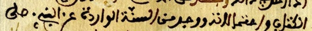
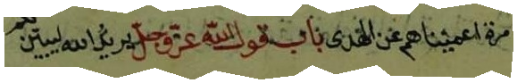
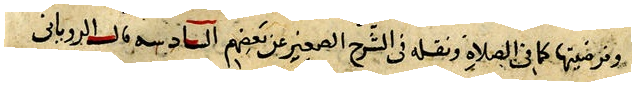
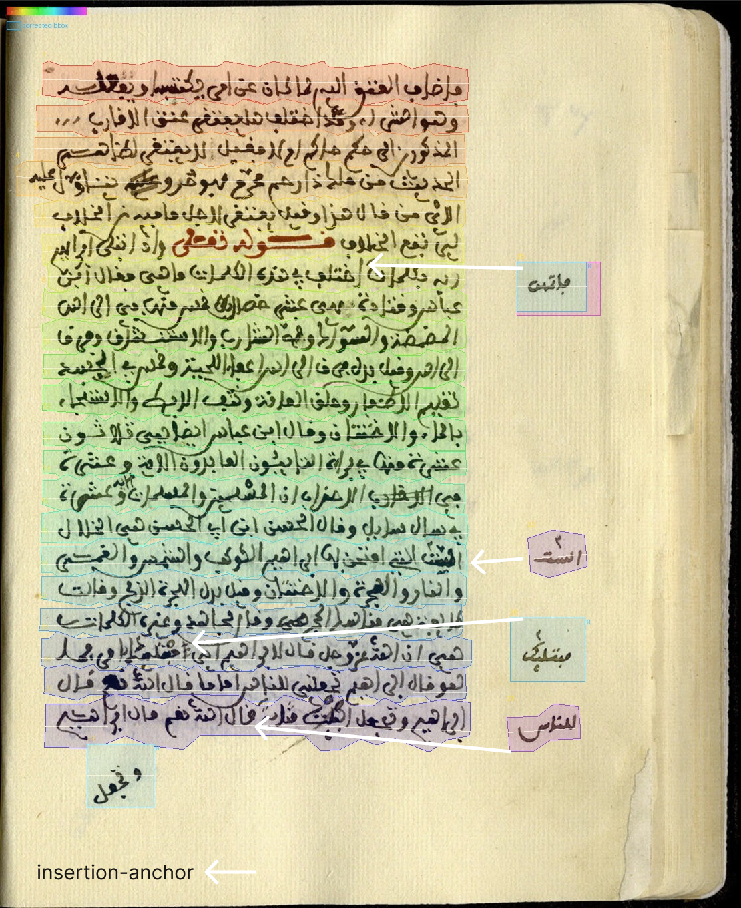

# AraMS-28k: Historical Arabic Manuscript Line Dataset

[](https://creativecommons.org/licenses/by-nc-sa/4.0/)
[](https://www.python.org/)
[]()
[]()
[](https://drive.google.com/file/d/1JCOFT-KE4PAJGVQYuXDnsQ1vsBNjUfdx/view?usp=sharing)

AraMS-28k is a line-level dataset of historical Arabic manuscripts produced by the
**RefLAM** (Reference-grounded Line Annotation for Manuscripts) pipeline. It comprises
**14 books**, **3,043 pages**, and **28,600 line annotations** (27,971 main-text + 629
margin lines) with bounding boxes, layout labels, and insertion anchors.

---
This repository holds the **code** used to build and reproduce AraMS-28k
(annotation schema, split definitions, the AraMS-28k-HTR build script,
and documentation). **Data is not stored in this repository** — download
it from Hugging Face  
[**AraMS-28k**](https://huggingface.co/datasets/Archatext/AraMS-28k)
[**AraMS-28k-HTR**](https://huggingface.co/datasets/Archatext/AraMS-28k-HTR)
[**HATFormer Checkpoints**](https://huggingface.co/Archatext/hatformer-arams28k)

---

## Overview

AraMS-28k comprises 14 books, 3,043 pages, and 28,600 annotated text
lines (27,971 main-text, 629 margin) spanning three hand-copied script
traditions — Naskh, Ruq'ah, and Maghrebi — plus one lithographed printed
edition. Every line is labelled as main-text or margin, and margin
lines with an unambiguous attachment point are further annotated with
an **insertion anchor**, recovering the manuscript's non-linear reading
order at line-level granularity — to our knowledge the first such
annotation released for a historical Arabic manuscript corpus.

## Dataset Statistics

| Property | Value |
|---|---|
| Books | 14 |
| Pages | 3,043 |
| Main lines | 27,971 |
| Margin lines | 629 |
| Confidently anchored margin lines | 189 / 629 (~30%) |
| Scripts | Naskh, Ruq'ah, Maghrebi (+1 lithographed volume) |
| Train / val / test split | 9 / 2 / 3 books |
| License | CC BY-NC-SA 4.0 |

Full per-book statistics: paper Appendix A.
## Script Diversity

<p float="left">
  
  
  
</p>

*Naskh, Ruq'ah, and Maghrebi hands sampled from the corpus.*

## Segmentation & Insertion-Anchor Example


Line-level segmentation (main-text vs. margin regions). Margin lines
with a confident attachment point are further annotated with an
insertion anchor — the main-text line they logically insert after.



## Download

Two release formats, matching the paper's Appendix C:

| Release | What | Where |
|---|---|---|
| **AraMS-28k** | full annotation release (images + geometry + raw/normalized text + anchors + review metadata) |  [**AraMS-28k**](https://huggingface.co/datasets/Archatext/AraMS-28k)
 |
| **AraMS-28k-HTR** | recognition-ready release (cropped line images + `.gt.txt`, ready for Kraken/HTR pipelines) | [**AraMS-28k-HTR**](https://huggingface.co/datasets/Archatext/AraMS-28k-HTR) |


### Checksums

```
376c1e19bf04d678f1052505e45e805dd2753ea182cb146614a546027925fa55  AraMS-28k.zip
8c4acccefae78f3940deb26af91a72d6aad80f67de175a287669dd9e297b2091  AraMS-28k-HTR.zip
```

Verify any download:
```bash
sha256sum -c SHA256SUMS.txt

python scripts/verify_checksums.py
```

## Repository Structure

```
checkpoints/  — Pretrained & fine-tuned model weights (git-ignored)
  └── hatformer/
      ├── original/       — Initial checkpoints (hatformer-synthetic, hatformer-muharaf)
      └── ours/           — Fine-tuned output checkpoints
configs/      — Model configurations (e.g. HATFormer fine-tuning)
schema/       — JSON Schema for the per-line annotation record
splits/       — book-level train/val/test assignment (splits.json)
scripts/      — HTR data builder (build_htr_data.py), HATFormer baseline scripts, and utilities
  ├── build_htr_data.py
  ├── htr_builder/
  └── models/
      └── hatformer/
          └── tokenizer/  — Tokenizer directory (requires tokenizer.json)
docs/         — annotation guidelines, FAQ
examples/     — notebook: load a record, draw its polygon/bbox on the page image
```

## Line Record Schema

```json
{
  "line_uid": "book_03_page_001_L000",
  "line_type": "main",
  "text": {
      "gt_raw": "...",
      "gt_normalized": "...",
      "gemini_raw": "...",
      "confidence": 100
  },
  "layout": {"insertion_anchor": null, "rotation": "horizontal"},
  "split": "train"
}
```

`gt_normalized` (diacritic-stripped, matched to what's visually present
in the hand) is the **recommended training target** for HTR models;
`gt_raw` is the fully vocalized reference. See `schema/line_record.schema.json`
and paper Sec. 4 for the full field list.

## Building AraMS-28k-HTR from AraMS-28k

After unzipping full annotation release [**AraMS-28k**](https://huggingface.co/datasets/Archatext/AraMS-28k), you will have a folder named AraMS-28k. This folder contains the raw dataset files, then use this script to build the HTR dataset from the raw dataset files to be ready for HTR training:

```bash
pip install -r requirements.txt 

python scripts/build_htr_data.py \                                              
    --input_dir ./AraMS-28k/annotations \
    --images_root ./AraMS-28k/images \
    --output_dir ./AraMS-28k-HTR \
    --split_cfg splits/split.json

```

Produces cropped `.png` line images + `.gt.txt` targets + a manifest (`metadata.csv`),
for both main and margin lines. See `docs/faq.md` for path-resolution
notes if you hit missing-image warnings.

## Model Fine-Tuning & Evaluation (HATFormer)

This repository includes scripts to fine-tune and evaluate HATFormer on the AraMS-28k-HTR dataset.

### Prerequisites & Setup

Before running training or evaluation, ensure the required checkpoint weights and tokenizer file are placed in their respective locations (these paths are git-ignored):

1. **Tokenizer**: Place `tokenizer.json` (Arabic BBPE tokenizer from Original HATFormer repository ) into:
   ```
   scripts/models/hatformer/tokenizer/tokenizer.json
   ```
2. **Pretrained Checkpoints**: Place the pretrained initial weights from original HATFormer repository into `checkpoints/hatformer/original/` :
   ```
   checkpoints/hatformer/original/hatformer-synthetic/
   checkpoints/hatformer/original/hatformer-muharaf/
   ```

### Fine-Tuning
```bash
python scripts/models/hatformer/train_hatformer.py --experiment muharaf_ours
```

### Recognition Test / Inference
```bash
python scripts/models/hatformer/test_hatformer.py --image path/to/image.png --checkpoint checkpoints/hatformer/ours/best
```

### Direct Model Loading (Hugging Face)

You can also load the fine-tuned model and tokenizer directly from Hugging Face:

```python
from transformers import VisionEncoderDecoderModel, PreTrainedTokenizerFast

model = VisionEncoderDecoderModel.from_pretrained("Archatext/hatformer-arams28k")
tokenizer = PreTrainedTokenizerFast.from_pretrained("Archatext/hatformer-arams28k")
```


## Citation

If you use **AraMS-28k** in your research, please cite:

```bibtex
@article{guechaoui2026arams28k,
  title={AraMS-28k: The Largest Publicly Released Line-Level Dataset of Historical Arabic Manuscripts with Margin and Insertion-Anchor Annotations},
  author={Guechaoui, Mohamed and Zellagui, Mohamed Diaa and Chaib, Souleyman and Dhelim, Sahraoui},
  journal={arXiv preprint arXiv:2608.26921},
  year={2026},
  doi={10.48550/arXiv.2608.26921}
}
```

If you use **RefLAM** or its annotation pipeline, please also cite:

```bibtex
@article{guechaoui2026reflam,
  title={RefLAM: A Reference-Grounded Line Annotation Pipeline for Historical Arabic Manuscripts},
  author={Guechaoui, Mohamed and Zellagui, Mohamed Diaa and Chaib, Souleyman and Dhelim, Sahraoui},
  journal={arXiv preprint arXiv:2608.25140},
  year={2026},
  doi={10.48550/arXiv.2608.25140}
}
```

### Related papers

- **AraMS-28k:** https://arxiv.org/abs/2608.26921
- **RefLAM:** https://arxiv.org/abs/2608.25140

## License

Released under **CC BY-NC-SA 4.0**. Reference transcriptions may carry
independent copyright where derived from a modern critical edition —
see `DATASHEET.md`.

